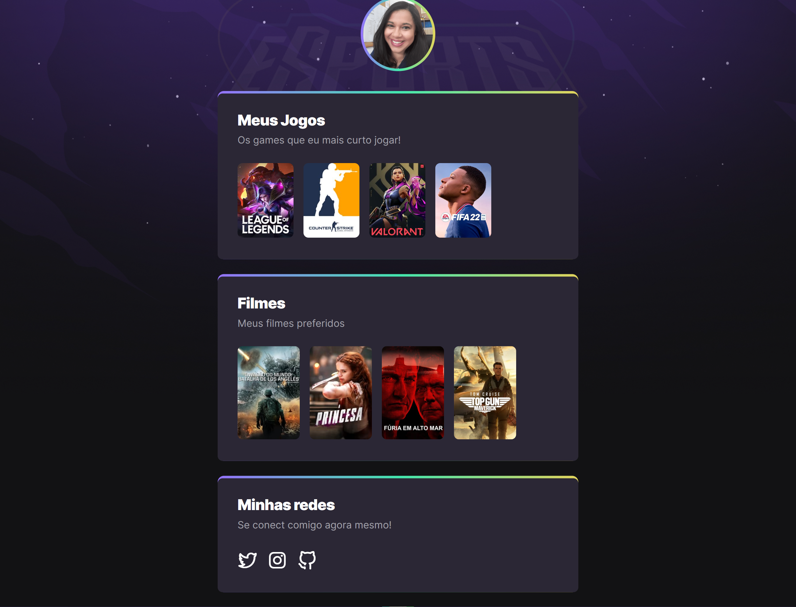

# NLW - eSports

> Trilha Explorer

Projeto desenvolvido no evento Next Level Week - NLW - da Rocketseat 🚀

A ideia é um a criação de um site que reune os jogos e canais preferidos e disponibilizar as redes sociais.

## 🛠️ Tecnologias utilizadas:

- HTML
- CSS

> 📝 Conceitos utilizados:

- pseudo classe hover;
- seleção de elementos com pseudo-classe nth:child();
- animações utilizando @keyframes;
- organização dos elementos com display flex;

### 🖥️ Resultado Final

🔗 O resultado final do projeto pode ser acessado através do link: https://mayaradias.github.io/_nlw_esports/
